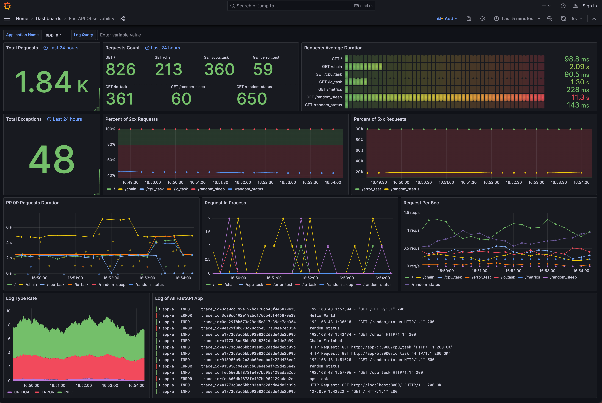

- Collecting necessary metrics and logs from the application becomes necessary when you actually want to know what is going on in your application at a glance.

- This can be done by, for example:
> - Ingesting logs into one source and querying/analyzing them.
> - Getting numbers for failed/successful API hits.
> - Tracking compute resources like memory/CPU usage over time for unusual spikes.
> - Generating alerts on unusual spikes and much more.

- This can be done using observability stacks like LGTM, ELK, Datadog, and many more. We will focus on a fully open-source solution like LGTM.
- LGTM includes using [Loki](https://grafana.com/oss/loki/) for collecting logs, [Grafana](https://grafana.com/grafana/) for visualization, [Prometheus](https://prometheus.io/docs/visualization/grafana/) for metrics, [Tempo](https://grafana.com/oss/tempo/) for trace data, and [Mimir](https://grafana.com/products/cloud/metrics/) for long-term storage.
- Once we have sufficient data, we can build a visualization that looks similar to:

To instrument your application to start collecting metrics, we will use Prometheus.
> - Start Prometheus and Grafana using [Docker](https://github.com/newtuple/fantastic-fiesta/blob/main/docker-compose-services.yml).
> - Define metrics like counter, gauge, and summary like [here](https://github.com/newtuple/fantastic-fiesta/blob/main/bot_service/src/backend/monitoring/prometheus.py).
> - Use the metrics like [here](https://github.com/newtuple/fantastic-fiesta/blob/main/bot_service/src/backend/user/controller.py#L70) to start collecting relevant data.
> - Either expose a [`/metrics`](https://github.com/newtuple/fantastic-fiesta/blob/main/bot_service/src/backend/metrics/controller.py#L19) endpoint to expose metrics data or use Pushgateway to push metrics to a source like self-hosted Prometheus, AWS/Azure managed Prometheus by setting a scrape [rule](https://github.com/newtuple/fantastic-fiesta/blob/main/LGTM/prometheus/prometheus.yml) which periodically scrapes metrics.
> - Connect Prometheus as a data source in Grafana and use [PromQL](https://prometheus.io/docs/prometheus/latest/querying/basics/) to start making relevant visuals!

Similarly, we can use Loki and Loki client to ingest log data.

**NOTE: While this works, there is a concept called OpenTelemetry which is tremendously helpful since different providers may have different ways of collecting logs, metrics, and traces. This standard helps in aligning that process.**
