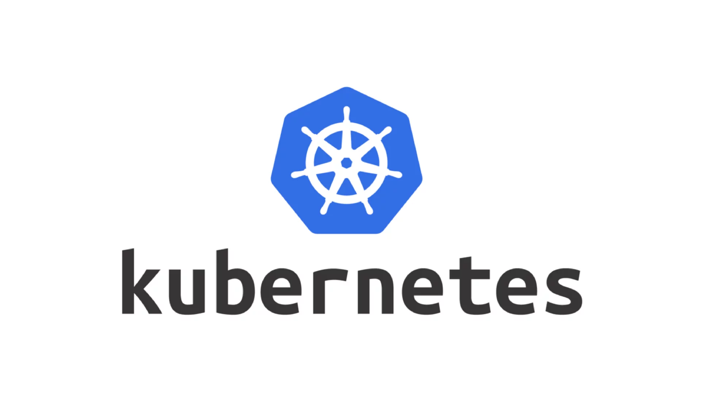

Kubernetes is a portable, extensible, open source platform for managing containerized workloads and services, that facilitates both declarative configuration and automation. It has a large, rapidly growing ecosystem. Kubernetes services, support, and tools are widely available.

- Get the [basics](https://kubernetes.io/docs/concepts/) and [terminology](https://medium.com/hashmapinc/30-second-kubernetes-concepts-cheat-sheet-98ba813194cb) right
- Understand why, how & when to use various [constructs](https://kubernetes.io/docs/tutorials/)
- What & how to leverage HPA [Horizontal Pod Autoscaler](https://kubernetes.io/docs/tasks/run-application/horizontal-pod-autoscale/) for automatic scaling of pods
- What are [ingress controllers](https://kubernetes.io/docs/concepts/services-networking/ingress/) and how to use them for load balancing and routing traffic to your services
- Use [minikube](https://kubernetes.io/docs/tutorials/hello-minikube/) to get start experimenting or directly on cluster from your cloud provider.

## To get started with deployment on k8
- Understand your application's infra needs [architecture](https://newtuple.atlassian.net/wiki/spaces/DAKB/pages/272400388/Scaling+with+K8s)
> - 
> - Build the necessary images which needs deployment
> - Tag them with respective version and container registry
> - Install [Helm](https://helm.sh/) and [kubectl](https://kubernetes.io/docs/tasks/tools/)
> - Once pushed, define helm chart [templates](https://github.com/newtuple/fantastic-fiesta/tree/main/infra/helm) for different services and login to your cluster & finally use helm commands to setup
[deployment](https://github.com/newtuple/fantastic-fiesta/blob/main/infra/helm/bot_service/templates/service_deployment.yaml), [horizantal pod scaler](https://github.com/newtuple/fantastic-fiesta/blob/main/infra/helm/bot_service/templates/hpa.yaml), ingress load balancer & [config maps](https://github.com/newtuple/fantastic-fiesta/blob/main/infra/helm/bot_service/templates/config_map.yaml) to automatically scrape metrics from the service in the respective namespace etc, setup [ingress controllers](../infra/helm/bot_service/templates/service_ingress.yaml), refer [ingress controller](https://newtuple.atlassian.net/wiki/spaces/DAKB/pages/313982978/Setting+up+ingress+controller+with+K8) for additional information.
> - All these commands are put together in [Makefile](https://github.com/newtuple/fantastic-fiesta/blob/main/infra/azure_infra_dev.mk) to reuse

**NOTE: The repo currently contains examples for commands in AZURE. Stay tuned for AWS & more.**
